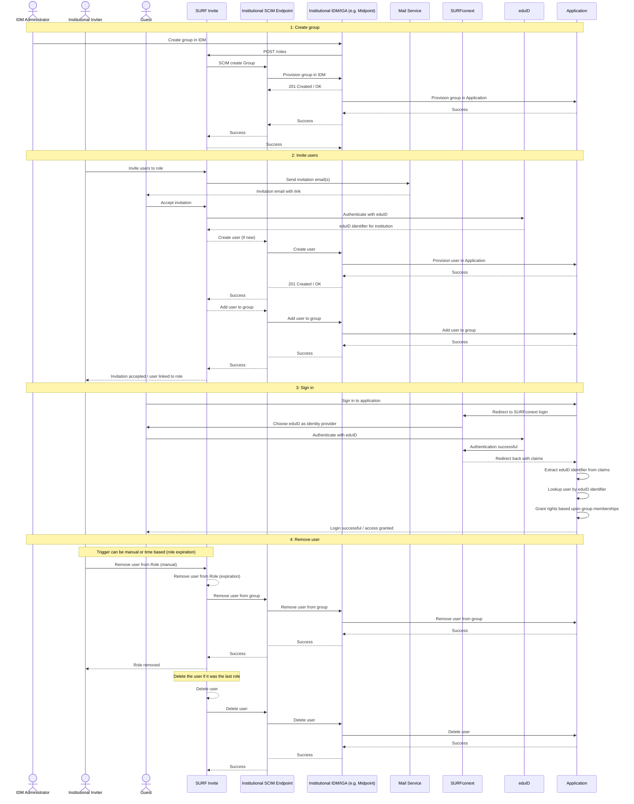

```mermaid
sequenceDiagram
    actor Admin as IDM Administrator
    actor Inviter as Institutional Inviter
    actor Guest as Guest
    participant Invite as SURF Invite
    participant SCIM as Institutional SCIM Endpoint
    participant IDM as Institutional IDM/IGA (e.g. Midpoint)
    participant Mail as Mail Service
    participant SC as SURFconext
    participant eduID as eduID
    participant APP as Application

    note over Admin, APP: 1: Create group
    Admin->>IDM: Create group in IDM
    IDM->>Invite: POST /roles
    Invite->>SCIM: SCIM create Group
    SCIM->>IDM: Provision group in IDM
    IDM-->>SCIM: 201 Created / OK
    IDM->>APP:Provision group in Application
    APP-->>IDM: Success
    IDM-->>SCIM: Success
    SCIM-->>Invite: Success
    Invite-->>IDM: Success


    note over Admin, APP: 2: Invite users
    Inviter->>Invite: Invite users to role
    Invite->>Mail: Send invitation email(s)
    Mail-->>Guest: Invitation email with link
    Guest->>Invite: Accept invitation
    Invite->>eduID: Authenticate with eduID
    eduID-->>Invite: eduID identifier for institution
    Invite-->>SCIM: Create user (if new)
    SCIM->>IDM: Create user
    IDM->>APP:Provision user in Application
    APP-->>IDM: Success
    IDM-->SCIM: 201 Created / OK
    SCIM-->>Invite: Success
    Invite-->>SCIM: Add user to group
    SCIM->>IDM: Add user to group
    IDM->>APP:Add user to group
    APP-->>IDM: Success
    IDM-->SCIM: Success
    SCIM-->>Invite: Success
    Invite-->>Inviter: Invitation accepted / user linked to role

    note over Admin, APP: 3: Sign in
    Guest->>APP: Sign in to application
    APP->>SC: Redirect to SURFconext login
    SC->>Guest: Choose eduID as identity provider
    Guest->>eduID: Authenticate with eduID
    eduID->>SC: Authentication successful
    SC-->>APP: Redirect back with claims
    APP->>APP: Extract eduID identifier from claims
    APP->>APP: Lookup user by eduID identifier
    APP->>APP: Grant rights based upon group memberships
    APP-->>Guest: Login successful / access granted

    note over Admin, APP: 4: Remove user
    note over Inviter,Invite: Trigger can be manual or time based (role expiration)
    Inviter->>Invite: Remove user from Role (manual)
    Invite-->>Invite: Remove user from Role (expiration)
    Invite->>SCIM: Remove user from group
    SCIM->>IDM: Remove user from group
    IDM->>APP: Remove user from group
    APP-->>IDM: Success
    IDM-->SCIM: Success
    SCIM-->>Invite: Success
    Invite-->>Inviter: Role removed
    note over Invite: Delete the user if it was the last role
    Invite-->>Invite: Delete user
    Invite->>SCIM: Delete user
    SCIM->>IDM: Delete user
    IDM->>APP: Delete user
    APP-->>IDM: Success
    IDM-->SCIM: Success
    SCIM-->>Invite: Success
```
